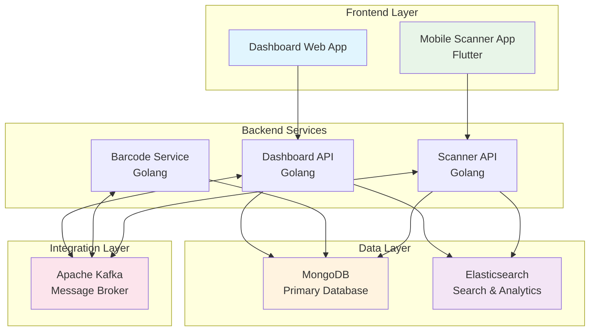
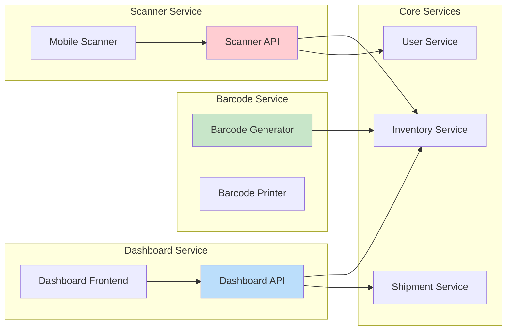
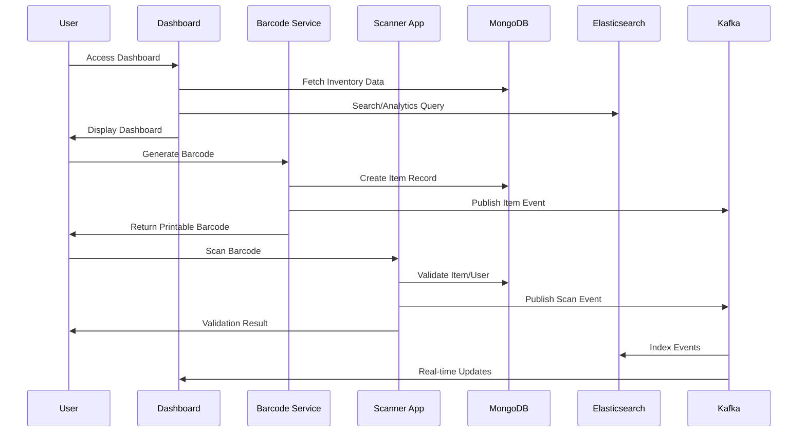
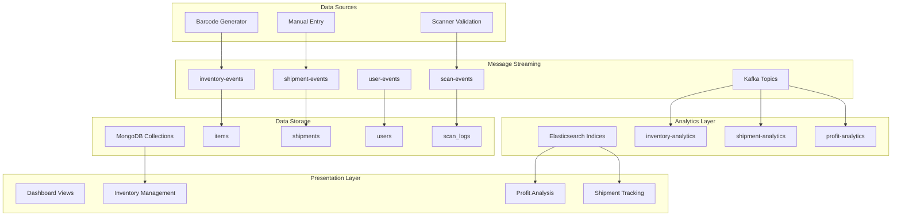
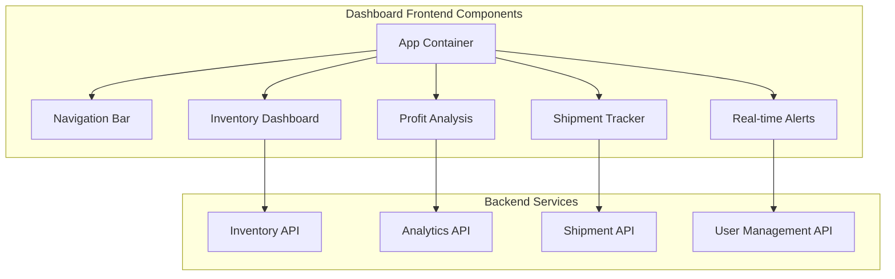
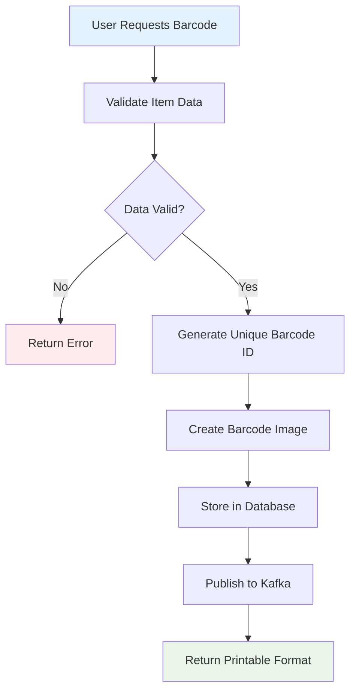
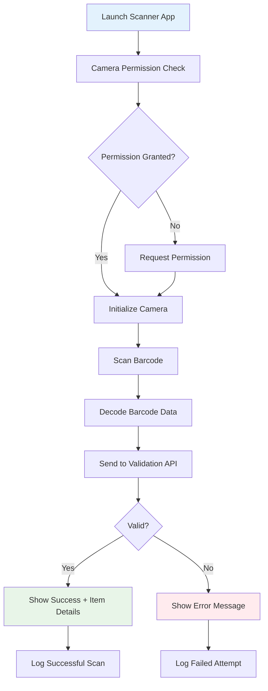
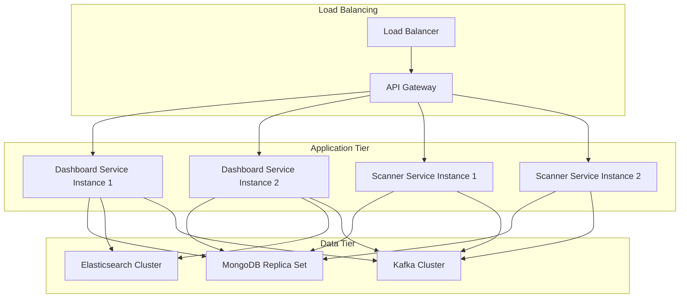

# PRD: Export-Import & Warehouse Management System

## Overview

The Export-Import & Warehouse Management System is a comprehensive solution consisting of three integrated applications designed to streamline warehouse operations, inventory management, and logistics tracking. The system provides real-time monitoring capabilities, automated barcode generation and validation, and comprehensive dashboard analytics for export-import operations.

### System Components
- **Dashboard Application**: Web-based management interface
- **Barcode Generator**: Printable barcode creation system  
- **Mobile Scanner**: Android-based barcode validation application

### Key Features
- Real-time inventory tracking and management
- Automated barcode generation and printing
- Mobile barcode scanning for item and user validation
- Comprehensive dashboard with profit margin analysis
- Shipment status tracking and delivery timeline monitoring
- High-throughput processing (120 TPS capacity)

## Technology Stack & Dependencies

### Frontend Technologies
- **Dashboard Frontend**: Modern web framework (React/Vue/Angular)
- **Mobile Scanner**: Flutter (Android APK)

### Backend Technologies
- **Dashboard Backend**: Golang
- **Search Engine**: Elasticsearch
- **Database**: MongoDB
- **Message Broker**: Apache Kafka (JSON format)

### Integration Architecture
- RESTful APIs for frontend-backend communication
- Kafka for inter-service messaging
- JSON-based data exchange format
- Microservices architecture pattern

## Architecture

### High-Level System Architecture



### Microservices Architecture



## System Flow & Data Architecture

### High-Level System Flow



### Data Flow Architecture



## Application Specifications

### 1. Dashboard Application

#### Component Architecture


#### Dashboard Features & Data Display

| Feature | Data Points | Update Frequency |
|---------|-------------|------------------|
| Item Management | Item ID, Name, Category, Stock Level | Real-time |
| Price Tracking | Cost Price, Selling Price, Currency | Real-time |
| Profit Analysis | Profit Margin %, Total Profit, ROI | Every 5 minutes |
| Shipment Duration | Estimated Delivery, Actual Duration | Real-time |
| Shipment Status | In Transit, Delivered, Delayed, Pending | Real-time |
| Delivery Timeline | Remaining Time, ETA, Progress % | Every minute |

#### API Endpoints Reference

**Inventory Management**
```
GET /api/v1/inventory/items
POST /api/v1/inventory/items
PUT /api/v1/inventory/items/{id}
DELETE /api/v1/inventory/items/{id}
```

**Analytics & Reporting**
```
GET /api/v1/analytics/profit-margins
GET /api/v1/analytics/shipment-performance
GET /api/v1/analytics/inventory-turnover
```

**Shipment Tracking**
```
GET /api/v1/shipments
GET /api/v1/shipments/{id}/status
PUT /api/v1/shipments/{id}/status
```

### 2. Barcode Generator Application

#### Barcode Generation Flow


#### Barcode Specifications

| Barcode Type | Format | Data Encoded |
|--------------|--------|--------------|
| Item Barcode | Code 128 | Item ID, Warehouse Location, Batch Number |
| User Barcode | QR Code | User ID, Access Level, Expiry Date |
| Shipment Barcode | Code 39 | Shipment ID, Destination, Priority |

### 3. Mobile Scanner Application (Flutter)

#### Scanner Application Flow


#### Validation Process

**Item Validation**
1. Decode barcode data
2. Query MongoDB for item existence
3. Check item status (active/inactive)
4. Verify warehouse location
5. Return validation result with item details

**User Validation**
1. Decode QR code data
2. Verify user credentials
3. Check access level permissions
4. Validate expiry date
5. Log access attempt

## Data Models & Database Schema

### MongoDB Collections

#### Items Collection
```json
{
  "_id": "ObjectId",
  "itemId": "ITM-2024-001",
  "name": "Product Name",
  "category": "Electronics",
  "barcode": "1234567890123",
  "costPrice": 100.00,
  "sellingPrice": 150.00,
  "profitMargin": 33.33,
  "stockLevel": 250,
  "warehouseLocation": "A1-B2-C3",
  "status": "active",
  "createdAt": "2024-01-01T00:00:00Z",
  "updatedAt": "2024-01-01T00:00:00Z"
}
```

#### Shipments Collection
```json
{
  "_id": "ObjectId",
  "shipmentId": "SHP-2024-001",
  "items": ["ITM-2024-001", "ITM-2024-002"],
  "destination": "Jakarta",
  "status": "in_transit",
  "estimatedDelivery": "2024-01-15T00:00:00Z",
  "actualDelivery": null,
  "remainingTime": "2 days 4 hours",
  "trackingNumber": "TRK123456789",
  "createdAt": "2024-01-01T00:00:00Z"
}
```

#### Users Collection
```json
{
  "_id": "ObjectId",
  "userId": "USR-2024-001",
  "username": "john.doe",
  "email": "john@company.com",
  "role": "warehouse_operator",
  "accessLevel": "level_2",
  "barcode": "QR_CODE_DATA",
  "isActive": true,
  "lastScan": "2024-01-01T00:00:00Z"
}
```

#### Scan Logs Collection
```json
{
  "_id": "ObjectId",
  "scanId": "SCN-2024-001",
  "userId": "USR-2024-001",
  "itemId": "ITM-2024-001",
  "scanType": "item_validation",
  "result": "success",
  "location": "Warehouse A",
  "deviceId": "DEVICE-001",
  "timestamp": "2024-01-01T00:00:00Z"
}
```

### Elasticsearch Indices

#### Inventory Analytics Index
```json
{
  "mappings": {
    "properties": {
      "itemId": {"type": "keyword"},
      "profitMargin": {"type": "float"},
      "stockTurnover": {"type": "float"},
      "salesVelocity": {"type": "float"},
      "timestamp": {"type": "date"}
    }
  }
}
```

## Kafka Integration & Messaging

### Kafka Topics Configuration

| Topic Name | Partitions | Replication Factor | Purpose |
|------------|------------|-------------------|---------|
| inventory-events | 3 | 2 | Item CRUD operations |
| shipment-events | 3 | 2 | Shipment status updates |
| scan-events | 6 | 2 | Barcode scan activities |
| user-events | 2 | 2 | User authentication/authorization |

### Message Schemas

#### Inventory Event Message
```json
{
  "eventType": "item_created",
  "eventId": "EVT-2024-001",
  "timestamp": "2024-01-01T00:00:00Z",
  "data": {
    "itemId": "ITM-2024-001",
    "action": "create",
    "changes": {
      "name": "New Product",
      "stockLevel": 100
    }
  }
}
```

#### Scan Event Message
```json
{
  "eventType": "barcode_scanned",
  "eventId": "EVT-2024-002",
  "timestamp": "2024-01-01T00:00:00Z",
  "data": {
    "scanId": "SCN-2024-001",
    "userId": "USR-2024-001",
    "itemId": "ITM-2024-001",
    "result": "success",
    "location": "Warehouse A"
  }
}
```

## Performance & Scalability

### Throughput Requirements
- **Target TPS**: 120 transactions per second
- **Peak Load Handling**: 150 TPS (25% overhead)
- **Response Time**: < 200ms for API calls
- **Scanner Validation**: < 100ms response time

### Scalability Architecture



### Performance Optimization Strategies

1. **Database Optimization**
   - MongoDB indexing on frequently queried fields
   - Connection pooling for high concurrency
   - Read replicas for analytics queries

2. **Caching Strategy**
   - Redis for session management
   - Application-level caching for static data
   - CDN for static assets

3. **Elasticsearch Optimization**
   - Index lifecycle management
   - Hot-warm architecture for time-series data
   - Bulk indexing for high-throughput scenarios

## Testing Strategy

### Unit Testing
- **Backend Services**: Go testing framework with >80% coverage
- **Frontend Components**: Jest/Testing Library for React components
- **Mobile App**: Flutter widget testing

### Integration Testing
- **API Testing**: Postman/Newman for automated API testing
- **Database Testing**: MongoDB test containers
- **Kafka Testing**: Embedded Kafka for message flow testing

### End-to-End Testing
- **Web Dashboard**: Cypress for user workflow testing
- **Mobile Scanner**: Flutter integration tests
- **Cross-system Testing**: Full barcode generation to scanning workflow

### Performance Testing
- **Load Testing**: Artillery.js for API load testing
- **Database Performance**: MongoDB profiler and explain plans
- **Mobile Performance**: Flutter performance profiling tools

## Project Implementation Plan

### Team Composition
- **2 Senior Developers**: Full-stack development, architecture, and code review
- **1 Junior Developer**: Assisted development and bug fixes
- **5 Junior Black Box Testers**: Manual testing, test case execution, and bug reporting

### Task Breakdown & Time Estimates

#### Phase 1: Project Setup & Infrastructure (Week 1-2)

| Task | Assignee | Estimated Hours | Duration |
|------|----------|----------------|----------|
| Project setup and repository structure | Senior Dev 1 | 8 | 1 day |
| Docker containerization setup | Senior Dev 1 | 16 | 2 days |
| MongoDB cluster setup and configuration | Senior Dev 2 | 12 | 1.5 days |
| Elasticsearch cluster setup | Senior Dev 2 | 12 | 1.5 days |
| Kafka cluster setup and topic configuration | Senior Dev 1 | 16 | 2 days |
| CI/CD pipeline setup | Senior Dev 2 | 20 | 2.5 days |
| Development environment documentation | Junior Dev | 8 | 1 day |
| **Phase 1 Total** | | **92 hours** | **~2 weeks** |

#### Phase 2: Backend Development (Week 3-8)

| Task | Assignee | Estimated Hours | Duration |
|------|----------|----------------|----------|
| **Core Backend Services** |
| User authentication & authorization API | Senior Dev 1 | 24 | 3 days |
| Inventory management API (CRUD) | Senior Dev 2 | 32 | 4 days |
| Barcode generation service | Senior Dev 1 | 20 | 2.5 days |
| Scanner validation API | Senior Dev 2 | 24 | 3 days |
| Shipment tracking API | Junior Dev (assisted) | 28 | 3.5 days |
| **Database Integration** |
| MongoDB data models and schemas | Senior Dev 1 | 16 | 2 days |
| Database indexes and optimization | Senior Dev 2 | 12 | 1.5 days |
| **Message Queue Integration** |
| Kafka producer/consumer setup | Senior Dev 1 | 20 | 2.5 days |
| Event-driven architecture implementation | Senior Dev 2 | 24 | 3 days |
| **Elasticsearch Integration** |
| Search and analytics service | Senior Dev 1 | 28 | 3.5 days |
| Real-time data indexing | Senior Dev 2 | 20 | 2.5 days |
| **API Documentation & Testing** |
| API documentation (OpenAPI/Swagger) | Junior Dev | 16 | 2 days |
| Unit tests for all services | Senior Dev 1 & 2 | 40 | 5 days |
| Integration tests | Senior Dev 1 & 2 | 32 | 4 days |
| **Phase 2 Total** | | **336 hours** | **~6 weeks** |

#### Phase 3: Frontend Development (Week 7-12)

| Task | Assignee | Estimated Hours | Duration |
|------|----------|----------------|----------|
| **Dashboard Frontend** |
| Project setup and routing | Senior Dev 1 | 8 | 1 day |
| UI component library setup | Senior Dev 1 | 12 | 1.5 days |
| Inventory management interface | Senior Dev 2 | 32 | 4 days |
| Profit analysis dashboard | Senior Dev 1 | 28 | 3.5 days |
| Shipment tracking interface | Junior Dev (assisted) | 24 | 3 days |
| Real-time notifications | Senior Dev 2 | 20 | 2.5 days |
| Responsive design implementation | Junior Dev | 16 | 2 days |
| **Mobile Scanner App (Flutter)** |
| Flutter project setup | Senior Dev 1 | 8 | 1 day |
| Camera integration and barcode scanning | Senior Dev 2 | 32 | 4 days |
| User authentication screens | Senior Dev 1 | 16 | 2 days |
| Item validation interface | Senior Dev 2 | 20 | 2.5 days |
| Offline data sync capability | Senior Dev 1 | 24 | 3 days |
| APK build and signing setup | Senior Dev 2 | 8 | 1 day |
| **Frontend Testing** |
| Component unit tests | Junior Dev | 20 | 2.5 days |
| Integration tests | Senior Dev 1 | 16 | 2 days |
| **Phase 3 Total** | | **284 hours** | **~5 weeks** |

#### Phase 4: System Integration & Testing (Week 13-16)

| Task | Assignee | Estimated Hours | Duration |
|------|----------|----------------|----------|
| **System Integration** |
| End-to-end integration testing | Senior Dev 1 & 2 | 32 | 4 days |
| Performance optimization | Senior Dev 1 & 2 | 24 | 3 days |
| Security audit and fixes | Senior Dev 1 | 16 | 2 days |
| **Black Box Testing** |
| Test case creation and documentation | Tester 1 & 2 | 40 | 5 days |
| Dashboard functionality testing | Tester 1 & 2 | 32 | 4 days |
| Mobile app testing (multiple devices) | Tester 3 & 4 | 40 | 5 days |
| Barcode generation and scanning testing | Tester 5 | 24 | 3 days |
| Cross-browser compatibility testing | Tester 1 & 3 | 24 | 3 days |
| API testing (Postman/automation) | Tester 2 & 4 | 32 | 4 days |
| Performance and load testing | Tester 5 | 20 | 2.5 days |
| **Bug Fixes and Iterations** |
| Bug fixes from testing phase | All Developers | 48 | 6 days |
| **Phase 4 Total** | | **332 hours** | **~4 weeks** |

#### Phase 5: Deployment & Documentation (Week 17-18)

| Task | Assignee | Estimated Hours | Duration |
|------|----------|----------------|----------|
| Production deployment setup | Senior Dev 1 & 2 | 20 | 2.5 days |
| Production database migration | Senior Dev 2 | 8 | 1 day |
| Load balancer and monitoring setup | Senior Dev 1 | 12 | 1.5 days |
| User documentation and training materials | Junior Dev | 16 | 2 days |
| Deployment documentation | Senior Dev 2 | 8 | 1 day |
| Final system testing in production | All Testers | 32 | 4 days |
| Go-live support and monitoring | Senior Dev 1 & 2 | 16 | 2 days |
| **Phase 5 Total** | | **112 hours** | **~2 weeks** |

### Project Timeline Summary

| Phase | Duration | Key Deliverables |
|-------|----------|------------------|
| **Phase 1: Setup** | 2 weeks | Infrastructure, development environment |
| **Phase 2: Backend** | 6 weeks | APIs, database, messaging, search |
| **Phase 3: Frontend** | 5 weeks | Dashboard, mobile app |
| **Phase 4: Testing** | 4 weeks | Integration, testing, bug fixes |
| **Phase 5: Deployment** | 2 weeks | Production deployment, documentation |
| **Total Project Duration** | **19 weeks** | **Complete system ready for production** |

### Resource Allocation Summary

| Role | Total Hours | Utilization |
|------|-------------|-------------|
| Senior Developer 1 | 420 hours | ~52 hours/week |
| Senior Developer 2 | 416 hours | ~52 hours/week |
| Junior Developer | 132 hours | ~17 hours/week |
| Black Box Testers (5) | 212 hours total | ~11 hours/week each |

### Risk Mitigation & Contingency

| Risk Factor | Mitigation Strategy | Additional Time |
|-------------|--------------------|-----------------|
| Complex integration issues | Regular integration testing | +1 week |
| Performance bottlenecks | Load testing in early phases | +3 days |
| Mobile device compatibility | Testing on multiple devices | +1 week |
| Third-party service delays | Mock services for development | +2 days |
| **Recommended Buffer** | | **+2 weeks** |

### Final Timeline Recommendation
- **Planned Duration**: 19 weeks
- **With Contingency**: 21 weeks
- **Total Project Cost**: ~1,156 hours across all team members